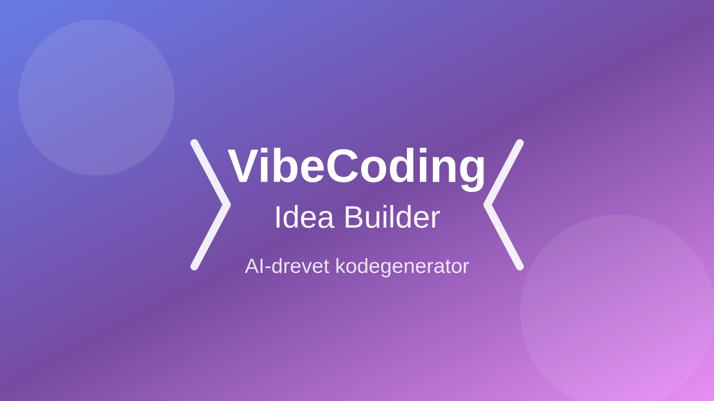
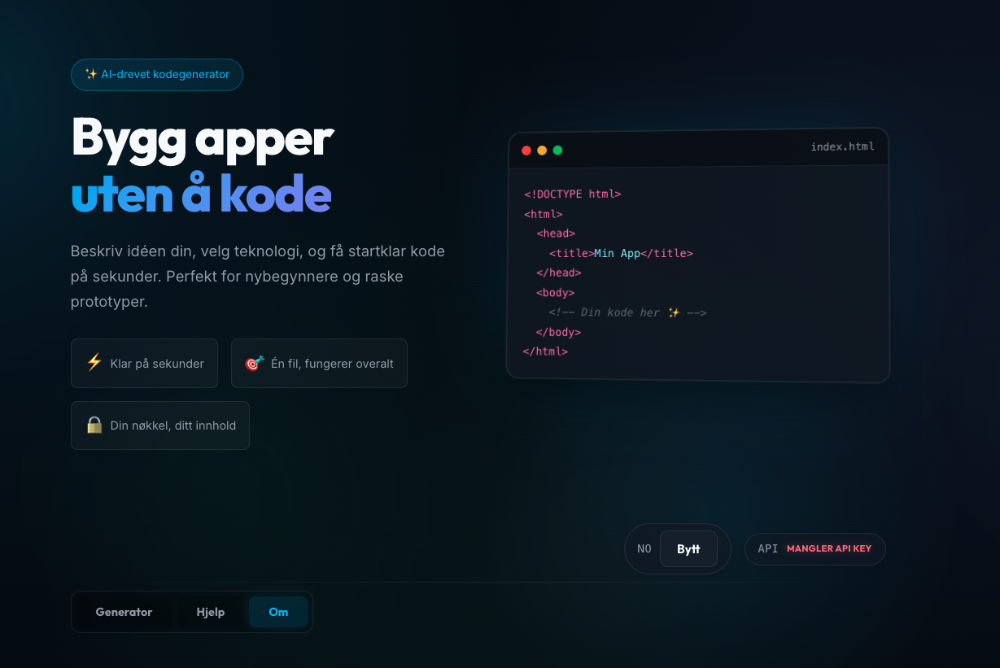
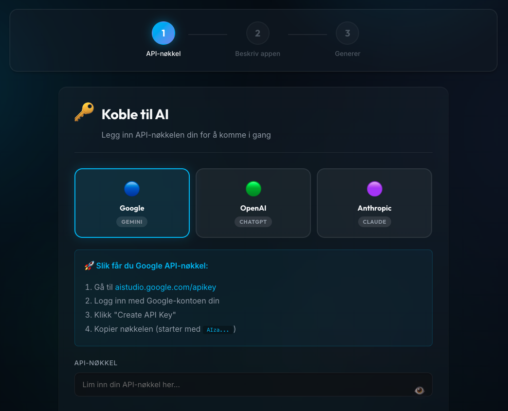

# VibeCoding Idea Builder



**VibeCoding Idea Builder** er et kraftig, AI-drevet verktøy for å generere startklare webprosjekter. Med en intuitiv veiviserbasert grensesnitt får du profesjonell, fungerende kode på sekunder – perfekt for lærere, studenter og utviklere som vil lære eller prototype raskt.

## 📸 Screenshots


*Steg 1: Velg AI-leverandør og legg inn API-nøkkel*


*Steg 2: Beskriv prosjektet ditt med strukturerte spørsmål*

## ✨ Funksjoner

### 🔑 Multi-Provider AI-støtte
- **Google Gemini** (gemini-2.5-flash, gemini-2.5-pro, gemini-2.0-flash, gemini-3-flash-preview, gemini-3-pro-preview)
- **OpenAI** (gpt-4.1, gpt-5-mini, gpt-5.2, gpt-5.2-pro, gpt-5-nano)
- **Anthropic Claude** (claude-sonnet-4-5, claude-opus-4-5, claude-haiku-4-5)
- **Lokal modellstøtte** (LM Studio eller lignende)

### 🧙‍♂️ Veiviser-basert arbeidsflyt
1. **API-konfigurasjon** - Velg leverandør og legg inn API-nøkkel med validering
2. **Prosjektbeskrivelse** - Strukturert skjema med smarte spørsmål
3. **Generering & Resultat** - Forhåndsvisning, nedlasting og kodevisning

### 🤖 AI-assistert promptforbedring
La AI-en forbedre og utvide prosjektbeskrivelsen din med profesjonelle detaljer og kreative forslag.

### 🎨 Premium Design-generering
Genererte prosjekter inkluderer:
- Mørk, moderne designprofil med gradienter
- Glassmorphism-effekter
- Smooth CSS-animasjoner og micro-interactions
- Responsivt design (mobil, tablet, desktop)
- Dark/Light mode toggle
- Loading states og progress indikatorer
- Toast notifications
- Sound effects (Web Audio API)

### 💾 Fleksible Eksportmuligheter
- **📋 Kopier** kode direkte til utklippstavlen
- **💾 Last ned** index.html
- **📦 Last ned ZIP** med alle filer (multi-file prosjekter)
- **👁️ Live Preview** direkte i browseren
- **📂 Filvisning** for multi-file prosjekter

### 🌐 Flerspråklig grensesnitt
- Norsk 🇳🇴
- Engelsk 🇬🇧

### 🔒 Personvern og Sikkerhet
- API-nøkkelen sendes direkte fra din nettleser til valgt AI-leverandør
- Ingen serverlagring - alt er 100% klientbasert
- Valgfri lokal lagring i `localStorage`
- Ingen avhengigheter til eksterne servere (bortsett fra AI-API)

## 🚀 Kom i gang

1. **Åpne `index.html`** i nettleseren din
2. **Velg AI-leverandør** (Google, OpenAI eller Anthropic)
3. **Legg inn API-nøkkel** fra din valgte leverandør:
   - Google: [aistudio.google.com/apikey](https://aistudio.google.com/apikey)
   - OpenAI: [platform.openai.com/api-keys](https://platform.openai.com/api-keys)
   - Anthropic: [console.anthropic.com/settings/keys](https://console.anthropic.com/settings/keys)
4. **Beskriv prosjektet** ved å svare på de 7 spørsmålene
5. **Generer** og få startklar kode!

## 📋 Prosjektstruktur

```
vibe_code_generator/
├── index.html          # Hovedapplikasjon
├── style.css           # Premium design-system
├── script.js           # AI-integrasjon og logikk
├── og-image.png        # Social media preview-bilde
├── laererliv-logo.png  # Logo
└── README.md           # Denne filen
```

## 🎯 Brukseksempler

### Eksempel 1: Quiz-app for studenter
```
Hva slags app? → Quiz-app
Målgruppe? → Videregående elever
Hovedfunksjon? → Multiple choice quiz med scoring
Data? → Spørsmål, svar, poeng
```

### Eksempel 2: Todo-liste med AI
```
Hva slags app? → Todo-liste
Målgruppe? → Produktive mennesker
Hovedfunksjon? → Legg til, fjern, marker som ferdig
Data? → Oppgaver med status og deadline
Design? → Glassmorphic med gradienter
```

## 🛠️ Teknisk informasjon

- **Ingen backend påkrevd** - Alt kjører i nettleseren
- **Ingen npm/build-prosess** - Bare åpne `index.html`
- **Vanilla JavaScript** - Ingen rammeverk nødvendig
- **CSS Custom Properties** - Enkelt å tilpasse
- **Semantic HTML5** - Tilgjengelig og moderne
- **Progressive Enhancement** - Fungerer overalt

## 💡 Tips og triks

- **Vær spesifikk** i prosjektbeskrivelsen for bedre resultater
- **Bruk AI-forbedring** for å få profesjonelle tillegg til beskrivelsen
- **Test lokalt** før du deployer (all kode kjører i browseren)
- **Kombiner modeller** - test forskjellige AI-leverandører for best resultat
- **Husk sikkerhet** - aldri commit API-nøkler til git

## 🔐 Personvern

- **Ingen server-side lagring** - Dette er en statisk HTML/CSS/JS applikasjon
- **API-nøkkel sendes direkte** til valgt AI-leverandør (Google/OpenAI/Anthropic)
- **Lokal lagring** kun hvis du velger "Lagre lokalt" (localStorage i browser)
- **Ingen tracking** eller analytics
- **Open source** - all kode er synlig og inspiserbar

## 📄 Lisens

Dette prosjektet er åpen kildekode og gratis å bruke til både personlige og kommersielle prosjekter.

## 🙏 Takk til

- Google Gemini, OpenAI og Anthropic for kraftige AI-modeller
- Alle som tester og gir tilbakemelding
- Open source-fellesskapet

---

**Laget med ❤️ for utdanning og kreativitet**

<p align="center">
  
</p>
