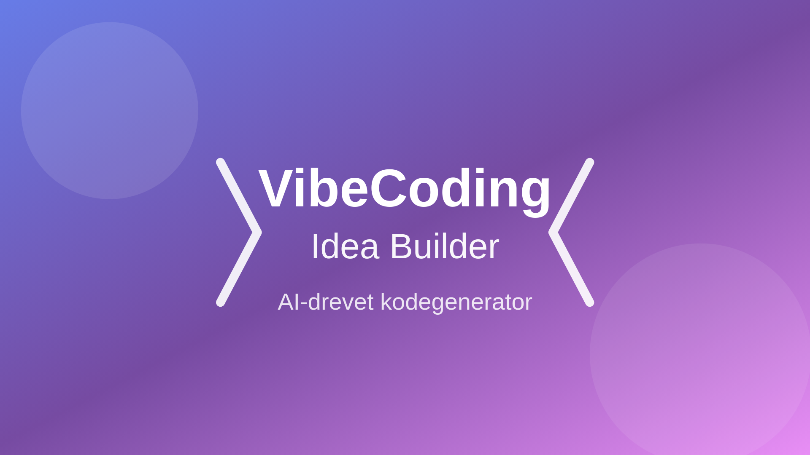
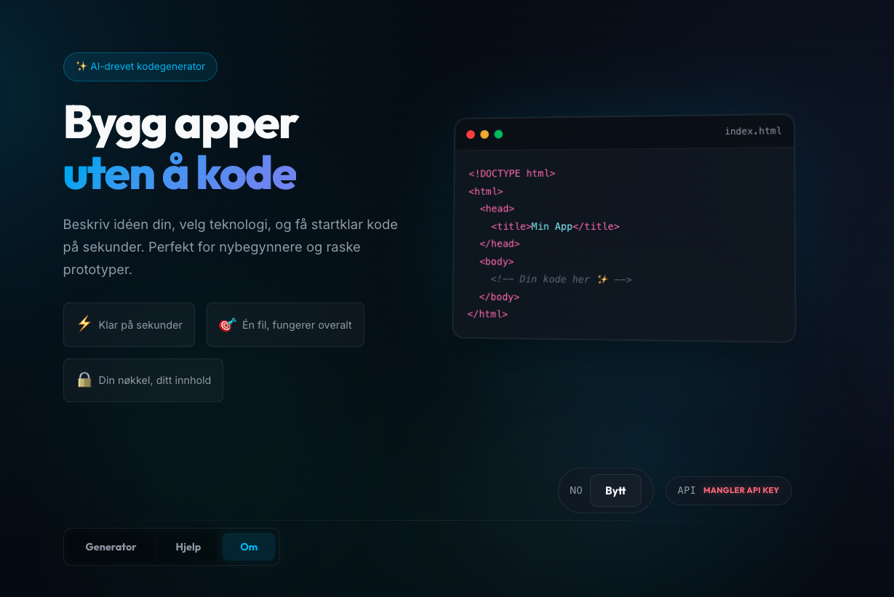
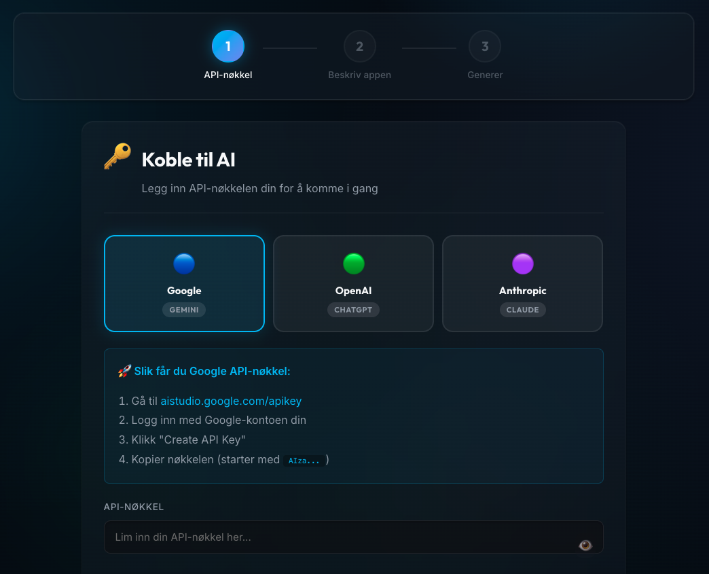
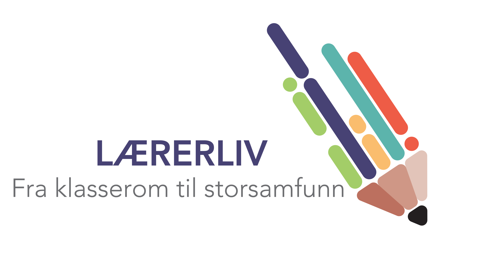

# VibeCoding Idea Builder



<div align="center">

**[🇳🇴 Norsk](#-norsk) | [🇬🇧 English](#-english)**

</div>

---

## 🇬🇧 English

**VibeCoding Idea Builder** is a powerful, AI-driven tool for generating ready-to-use web projects. With an intuitive wizard-based interface, you get professional, working code in seconds – perfect for teachers, students, and developers who want to learn or prototype quickly.

### 📸 Screenshots


*Step 1: Select AI provider and enter API key*


*Step 2: Describe your project with structured questions*

### ✨ Features

#### 🔑 Multi-Provider AI Support
- **Google Gemini** (gemini-2.5-flash, gemini-2.5-pro, gemini-2.0-flash, gemini-3-flash-preview, gemini-3-pro-preview)
- **OpenAI** (gpt-4.1, gpt-5-mini, gpt-5.2, gpt-5.2-pro, gpt-5-nano)
- **Anthropic Claude** (claude-sonnet-4-5, claude-opus-4-5, claude-haiku-4-5)
- **Local model support** (LM Studio or similar)

#### 🧙‍♂️ Wizard-Based Workflow
1. **API Configuration** - Select provider and enter API key with validation
2. **Project Description** - Structured form with smart questions
3. **Generation & Result** - Preview, download, and code viewing

#### 🤖 AI-Assisted Prompt Improvement
Let the AI enhance and expand your project description with professional details and creative suggestions.

#### 🎨 Premium Design Generation
Generated projects include:
- Dark, modern design profile with gradients
- Glassmorphism effects
- Smooth CSS animations and micro-interactions
- Responsive design (mobile, tablet, desktop)
- Dark/Light mode toggle
- Loading states and progress indicators
- Toast notifications
- Sound effects (Web Audio API)

#### 💾 Flexible Export Options
- **📋 Copy** code directly to clipboard
- **💾 Download** index.html
- **📦 Download ZIP** with all files (multi-file projects)
- **👁️ Live Preview** directly in browser
- **📂 File View** for multi-file projects

#### 🌐 Multilingual Interface
- Norwegian 🇳🇴
- English 🇬🇧

#### 🔒 Privacy & Security
- API key sent directly from your browser to selected AI provider
- No server storage - everything is 100% client-based
- Optional local storage in `localStorage`
- No dependencies on external servers (except AI API)

### 🚀 Getting Started

1. **Open `index.html`** in your browser
2. **Select AI provider** (Google, OpenAI, or Anthropic)
3. **Enter API key** from your chosen provider:
   - Google: [aistudio.google.com/apikey](https://aistudio.google.com/apikey)
   - OpenAI: [platform.openai.com/api-keys](https://platform.openai.com/api-keys)
   - Anthropic: [console.anthropic.com/settings/keys](https://console.anthropic.com/settings/keys)
4. **Describe the project** by answering the 7 questions
5. **Generate** and get ready-to-run code!

### 📋 Project Structure

```
vibe_code_generator/
├── index.html          # Main application
├── style.css           # Premium design system
├── script.js           # AI integration and logic
├── og-image.png        # Social media preview image
├── laererliv-logo.png  # Logo
└── README.md           # This file
```

### 🎯 Usage Examples

#### Example 1: Quiz app for students
```
What kind of app? → Quiz app
Target audience? → High school students
Main function? → Multiple choice quiz with scoring
Data? → Questions, answers, points
```

#### Example 2: Todo list with AI
```
What kind of app? → Todo list
Target audience? → Productive people
Main function? → Add, remove, mark as done
Data? → Tasks with status and deadline
Design? → Glassmorphic with gradients
```

### 🛠️ Technical Information

- **No backend required** - Everything runs in the browser
- **No npm/build process** - Just open `index.html`
- **Vanilla JavaScript** - No frameworks necessary
- **CSS Custom Properties** - Easy to customize
- **Semantic HTML5** - Accessible and modern
- **Progressive Enhancement** - Works everywhere

### 💡 Tips & Tricks

- **Be specific** in project description for better results
- **Use AI improvement** to get professional additions to description
- **Test locally** before deploying (all code runs in browser)
- **Try different models** - test different AI providers for best results
- **Remember security** - never commit API keys to git

### 🔐 Security & Privacy

#### Is it safe to use my API key?

**YES** - but follow these recommendations for best security:

##### ✅ How it works
- **Direct communication:** API key sent directly from your browser to AI provider
- **No middleman:** We NEVER store the key on our servers
- **Encrypted transfer:** All communication goes over HTTPS
- **Open source:** All code is open and inspectable - no hidden features

##### 🛡️ Security measures implemented
- **Content Security Policy (CSP):** Protects against XSS attacks
- **Subresource Integrity (SRI):** Verifies CDN resources aren't compromised
- **No innerHTML with user data:** Prevents script injection
- **Session-only as default:** Key not stored automatically

##### ⚠️ Important recommendations

**DO this:**
- ✅ Use a dedicated "test" API key only for this tool
- ✅ Set spending limits with AI provider ($5-10/month)
- ✅ Enable spending alerts to avoid surprises
- ✅ Use "Don't save" on shared or public machines
- ✅ Review installed browser extensions (they can read all inputs)
- ✅ Rotate the key if you think it may be compromised

**DON'T do this:**
- ❌ Use production API keys here
- ❌ Share screenshots with key visible
- ❌ Save key on shared computers (school, library, etc.)
- ❌ Install unknown browser extensions
- ❌ Commit API keys to git repositories

### 📄 License

This project is open source and free to use for both personal and commercial projects.

### 🙏 Thanks to

- Google Gemini, OpenAI, and Anthropic for powerful AI models
- Everyone who tests and provides feedback
- The open source community

---

## 🇳🇴 Norsk

**VibeCoding Idea Builder** er et kraftig, AI-drevet verktøy for å generere startklare webprosjekter. Med en intuitiv veiviserbasert grensesnitt får du profesjonell, fungerende kode på sekunder – perfekt for lærere, studenter og utviklere som vil lære eller prototype raskt.

### 📸 Screenshots


*Steg 1: Velg AI-leverandør og legg inn API-nøkkel*


*Steg 2: Beskriv prosjektet ditt med strukturerte spørsmål*

### ✨ Funksjoner

#### 🔑 Multi-Provider AI-støtte
- **Google Gemini** (gemini-2.5-flash, gemini-2.5-pro, gemini-2.0-flash, gemini-3-flash-preview, gemini-3-pro-preview)
- **OpenAI** (gpt-4.1, gpt-5-mini, gpt-5.2, gpt-5.2-pro, gpt-5-nano)
- **Anthropic Claude** (claude-sonnet-4-5, claude-opus-4-5, claude-haiku-4-5)
- **Lokal modellstøtte** (LM Studio eller lignende)

#### 🧙‍♂️ Veiviser-basert arbeidsflyt
1. **API-konfigurasjon** - Velg leverandør og legg inn API-nøkkel med validering
2. **Prosjektbeskrivelse** - Strukturert skjema med smarte spørsmål
3. **Generering & Resultat** - Forhåndsvisning, nedlasting og kodevisning

#### 🤖 AI-assistert promptforbedring
La AI-en forbedre og utvide prosjektbeskrivelsen din med profesjonelle detaljer og kreative forslag.

#### 🎨 Premium Design-generering
Genererte prosjekter inkluderer:
- Mørk, moderne designprofil med gradienter
- Glassmorphism-effekter
- Smooth CSS-animasjoner og micro-interactions
- Responsivt design (mobil, tablet, desktop)
- Dark/Light mode toggle
- Loading states og progress indikatorer
- Toast notifications
- Sound effects (Web Audio API)

#### 💾 Fleksible Eksportmuligheter
- **📋 Kopier** kode direkte til utklippstavlen
- **💾 Last ned** index.html
- **📦 Last ned ZIP** med alle filer (multi-file prosjekter)
- **👁️ Live Preview** direkte i browseren
- **📂 Filvisning** for multi-file prosjekter

#### 🌐 Flerspråklig grensesnitt
- Norsk 🇳🇴
- Engelsk 🇬🇧

#### 🔒 Personvern og Sikkerhet
- API-nøkkelen sendes direkte fra din nettleser til valgt AI-leverandør
- Ingen serverlagring - alt er 100% klientbasert
- Valgfri lokal lagring i `localStorage`
- Ingen avhengigheter til eksterne servere (bortsett fra AI-API)

### 🚀 Kom i gang

1. **Åpne `index.html`** i nettleseren din
2. **Velg AI-leverandør** (Google, OpenAI eller Anthropic)
3. **Legg inn API-nøkkel** fra din valgte leverandør:
   - Google: [aistudio.google.com/apikey](https://aistudio.google.com/apikey)
   - OpenAI: [platform.openai.com/api-keys](https://platform.openai.com/api-keys)
   - Anthropic: [console.anthropic.com/settings/keys](https://console.anthropic.com/settings/keys)
4. **Beskriv prosjektet** ved å svare på de 7 spørsmålene
5. **Generer** og få startklar kode!

### 📋 Prosjektstruktur

```
vibe_code_generator/
├── index.html          # Hovedapplikasjon
├── style.css           # Premium design-system
├── script.js           # AI-integrasjon og logikk
├── og-image.png        # Social media preview-bilde
├── laererliv-logo.png  # Logo
└── README.md           # Denne filen
```

### 🎯 Brukseksempler

#### Eksempel 1: Quiz-app for studenter
```
Hva slags app? → Quiz-app
Målgruppe? → Videregående elever
Hovedfunksjon? → Multiple choice quiz med scoring
Data? → Spørsmål, svar, poeng
```

#### Eksempel 2: Todo-liste med AI
```
Hva slags app? → Todo-liste
Målgruppe? → Produktive mennesker
Hovedfunksjon? → Legg til, fjern, marker som ferdig
Data? → Oppgaver med status og deadline
Design? → Glassmorphic med gradienter
```

### 🛠️ Teknisk informasjon

- **Ingen backend påkrevd** - Alt kjører i nettleseren
- **Ingen npm/build-prosess** - Bare åpne `index.html`
- **Vanilla JavaScript** - Ingen rammeverk nødvendig
- **CSS Custom Properties** - Enkelt å tilpasse
- **Semantic HTML5** - Tilgjengelig og moderne
- **Progressive Enhancement** - Fungerer overalt

### 💡 Tips og triks

- **Vær spesifikk** i prosjektbeskrivelsen for bedre resultater
- **Bruk AI-forbedring** for å få profesjonelle tillegg til beskrivelsen
- **Test lokalt** før du deployer (all kode kjører i browseren)
- **Kombiner modeller** - test forskjellige AI-leverandører for best resultat
- **Husk sikkerhet** - aldri commit API-nøkler til git

### 🔐 Sikkerhet & Personvern

#### Er det trygt å bruke min API-nøkkel?

**JA** - men følg disse anbefalingene for best mulig sikkerhet:

##### ✅ Slik fungerer det
- **Direkte kommunikasjon:** API-nøkkelen sendes direkte fra din nettleser til AI-leverandøren
- **Ingen mellommann:** Vi lagrer ALDRI nøkkelen på våre servere
- **Kryptert overføring:** All kommunikasjon går over HTTPS
- **Open source:** All kode er åpen og inspiserbar - ingen skjulte funksjoner

##### 🛡️ Sikkerhetstiltak implementert
- **Content Security Policy (CSP):** Beskytter mot XSS-angrep
- **Subresource Integrity (SRI):** Verifiserer at CDN-ressurser ikke er kompromittert
- **Ingen innerHTML med brukerdata:** Hindrer script injection
- **Session-only som default:** Nøkkel lagres ikke automatisk

##### ⚠️ Viktige anbefalinger

**GJØR dette:**
- ✅ Bruk en dedikert "test" API-nøkkel kun for dette verktøyet
- ✅ Sett utgiftsgrenser hos AI-leverandøren ($5-10/måned)
- ✅ Aktiver utgiftsalarmer for å unngå overraskelser
- ✅ Bruk "Ikke lagre" på delte eller offentlige maskiner
- ✅ Revurder installerte browser extensions (de kan lese alle inputs)
- ✅ Roter nøkkelen hvis du tror den kan være kompromittert

**IKKE gjør dette:**
- ❌ Bruk produksjons-API-nøkler her
- ❌ Del skjermbilder med nøkkelen synlig
- ❌ Lagre nøkkel på delte datamaskiner (skole, bibliotek, etc.)
- ❌ Installer ukjente browser extensions
- ❌ Commit API-nøkler til git repositories

##### 🔍 Potensielle risikoer

**Hva du er beskyttet mot:**
- ✅ Man-in-the-middle angrep (HTTPS)
- ✅ XSS-angrep (CSP + sanitering)
- ✅ Kompromitterte CDN-ressurser (SRI)
- ✅ Server-side datalekkasje (vi har ingen server)

**Hva DU må beskytte deg mot:**
- ⚠️ Ondsinnede browser extensions (kan lese localStorage og inputs)
- ⚠️ Fysisk tilgang til maskinen (noen ser over skulderen din)
- ⚠️ Keyloggers og malware på din enhet
- ⚠️ Phishing-angrep (falske nettsider)

#### Personvern

- **Ingen server-side lagring** - Dette er en statisk HTML/CSS/JS applikasjon
- **API-nøkkel sendes direkte** til valgt AI-leverandør (Google/OpenAI/Anthropic)
- **Lokal lagring** kun hvis du velger "Lagre lokalt" (localStorage i browser - ikke kryptert)
- **Ingen tracking** eller analytics
- **Open source** - all kode er synlig og inspiserbar

#### Slik roterer du en kompromittert nøkkel

Hvis du tror nøkkelen din kan være kompromittert:

**Google Gemini:**
1. Gå til [aistudio.google.com/apikey](https://aistudio.google.com/apikey)
2. Slett den gamle nøkkelen
3. Opprett en ny

**OpenAI:**
1. Gå til [platform.openai.com/api-keys](https://platform.openai.com/api-keys)
2. Revoke den gamle nøkkelen
3. Opprett en ny

**Anthropic:**
1. Gå til [console.anthropic.com/settings/keys](https://console.anthropic.com/settings/keys)
2. Slett den gamle nøkkelen
3. Opprett en ny

### 📄 Lisens

Dette prosjektet er åpen kildekode og gratis å bruke til både personlige og kommersielle prosjekter.

### 🙏 Takk til

- Google Gemini, OpenAI og Anthropic for kraftige AI-modeller
- Alle som tester og gir tilbakemelding
- Open source-fellesskapet

---

<p align="center">
  <strong>Made with ❤️ for education and creativity</strong><br>
  <strong>Laget med ❤️ for utdanning og kreativitet</strong>
</p>

<p align="center">
  
</p>
